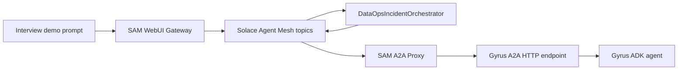

# Gyrus + Solace Agent Mesh A2A Demo

This demo connects your local Gyrus ADK agent to Solace Agent Mesh through the A2A protocol.

## Architecture



## One-Time Setup

Clone Solace Agent Mesh beside Gyrus:

```bash
cd /Users/priyankmalviya/Desktop/opensource
git clone https://github.com/SolaceLabs/solace-agent-mesh.git
cd solace-agent-mesh
uv sync
```

You already have Gyrus at:

```bash
/Users/priyankmalviya/Desktop/opensource/Gyrus
```

## Terminal 1: Start Gyrus As A2A

Use the Gyrus virtualenv so all ADK dependencies come from your existing checkout.

```bash
cd /private/tmp/solace-dataops-agent-mesh
GYRUS_REPO=/Users/priyankmalviya/Desktop/opensource/Gyrus \
GYRUS_A2A_AGENT_MODULE=gyrus_ai.objagents.sub_agents.analytical.frosty.objagents.agent \
GYRUS_A2A_AGENT_ATTR=root_agent \
GYRUS_A2A_HOST=127.0.0.1 \
GYRUS_A2A_PORT=8004 \
/Users/priyankmalviya/Desktop/opensource/Gyrus/venv/bin/python scripts/start_gyrus_a2a.py
```

Expected output:

```text
Loaded Gyrus agent: CLOUD_DATA_ARCHITECT
A2A endpoint: http://127.0.0.1:8004
Agent card:   http://127.0.0.1:8004/.well-known/agent-card.json
```

## Terminal 2: Smoke-Test A2A Directly

This proves Gyrus speaks A2A before Solace is introduced.

```bash
cd /private/tmp/solace-dataops-agent-mesh
/Users/priyankmalviya/Desktop/opensource/Gyrus/venv/bin/python scripts/check_gyrus_a2a.py
```

You should see the agent card name, skills, and a short response to the incident prompt.

## Terminal 3: Run Solace Agent Mesh With The A2A Proxy

Set LLM variables for the LiteLLM-compatible model endpoint you want SAM to use.

```bash
cd /Users/priyankmalviya/Desktop/opensource/solace-agent-mesh
export PYTHONPATH=src
export SOLACE_DEV_MODE=true
export NAMESPACE=local/gyrus-demo
export GYRUS_A2A_URL=http://127.0.0.1:8004
export LLM_SERVICE_ENDPOINT="http://localhost:11434/v1"
export LLM_SERVICE_API_KEY="local-demo"
export LLM_SERVICE_PLANNING_MODEL_NAME="openai/qwen3.5:397b-cloud"
export LLM_SERVICE_GENERAL_MODEL_NAME="openai/qwen3.5:397b-cloud"

uv run python cli/main.py task run \
  "We have a production checkout analytics incident. The application is processing successful payments, but the executive Snowflake orders dashboard is stale by 18 minutes and the ops team sees missing recent orders. Coordinate the investigation through the available agents. I need a concise incident report with likely root cause, what evidence to collect in Snowflake, freshness checks to run, safe remediation steps, and follow-up prevention work." \
  -c /private/tmp/solace-dataops-agent-mesh/sam-a2a-demo/config/shared_config.yaml \
  -c /private/tmp/solace-dataops-agent-mesh/sam-a2a-demo/config/gyrus_a2a_proxy.yaml \
  -c /private/tmp/solace-dataops-agent-mesh/sam-a2a-demo/config/orchestrator.yaml \
  -c /private/tmp/solace-dataops-agent-mesh/sam-a2a-demo/config/webui_gateway.yaml \
  --agent DataOpsIncidentOrchestrator \
  --startup-timeout 90 \
  --timeout 300 \
  --system-env
```

Expected behavior:

- SAM starts in local dev mode.
- The A2A proxy reads the Gyrus/Frosty agent card from `http://127.0.0.1:8004/.well-known/agent-card.json`.
- The orchestrator discovers `GyrusDataOps`.
- The orchestrator delegates the database/cloud-data diagnostic work to Gyrus over A2A.
- The final streamed answer is an incident report.

Expected non-blocking warnings:

- `Static files directory ... frontend/static not found`: harmless for `sam task run`; the API gateway still runs.
- `Cost tracking unavailable for model openai/qwen3.5:397b-cloud`: LiteLLM does not have pricing metadata for the local model, but token usage still works.
- `Error closing SSE connections during cleanup`: observed after successful task completion during shutdown.

## Demo Talk Track

1. Show the Gyrus A2A agent card in the browser or with `curl`.
2. Run the direct A2A smoke test to prove this is standard A2A, not a custom integration.
3. Run `sam task run` and explain that Solace Agent Mesh is handling discovery, routing, orchestration, and delegation.
4. Point out the separation of concerns: Gyrus owns domain intelligence, Solace Agent Mesh owns event-driven coordination.

## Optional PostgreSQL-Specific Variant

Gyrus has a PostgreSQL sub-agent at:

```text
gyrus_ai.objagents.sub_agents.relational.postgresai.objagents.agent
```

At the time this runbook was created, the local PostgresAI branch was not interview-demo ready:

- `postgresai/objagents/tools.py` had a small indentation error, which this workspace fixed.
- After that, many nested PostgresAI agents still passed `before_tool_callback` / `after_tool_callback` into `AgentTool`, but the installed ADK version does not accept those arguments.

After updating those PostgresAI agent wrappers or aligning the ADK version, you can expose only PostgresAI by changing:

```bash
GYRUS_A2A_AGENT_MODULE=gyrus_ai.objagents.sub_agents.relational.postgresai.objagents.agent
```
